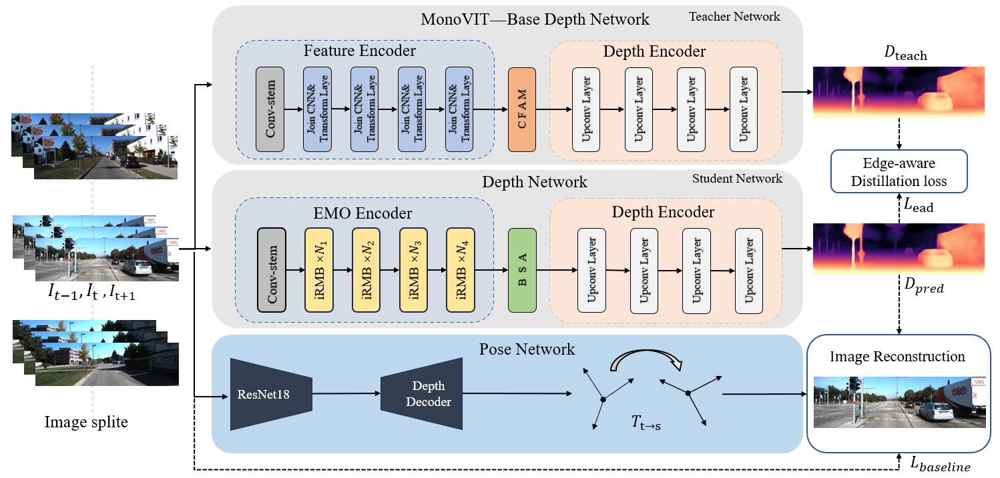

# LEA-Depth

This is the reference PyTorch implementation for training and testing depth estimation models using the method described in

## 👀Overview



## ⚙️Setup

Assuming a fresh [Anaconda](https://www.anaconda.com/download/) distribution, you can install the dependencies with:
```shell
pip3 install torch==1.9.0+cu111 torchvision==0.10.0+cu111 torchaudio==0.9.0
pip install dominate==2.4.0 Pillow==6.1.0 visdom==0.1.8
pip install tensorboardX==1.4 opencv-python  matplotlib scikit-image
pip3 install mmcv-full==1.3.0 mmsegmentation==0.11.0  
pip install timm einops IPython
```
 We ran our experiments with PyTorch 1.9.0, CUDA 11.1, Python 3.7 and Ubuntu 18.04. 

 Note that our code is built based on [Monodepth2](https://github.com/nianticlabs/monodepth2). However, we only use it for Monocular videos training and estimation.


## 

## 💾KITTI training data

You can download the entire [raw KITTI dataset](http://www.cvlibs.net/datasets/kitti/raw_data.php) by running:
```shell
wget -i splits/kitti_archives_to_download.txt -P kitti_data/
```
Then unzip with
```shell
cd kitti_data
unzip "*.zip"
cd ..
```
**Warning:** it weighs about **175GB**, so make sure you have enough space to unzip too!

Our default settings expect that you have converted the png images to jpeg with this command, **which also deletes the raw KITTI `.png` files**:
```shell
find kitti_data/ -name '*.png' | parallel 'convert -quality 92 -sampling-factor 2x2,1x1,1x1 {.}.png {.}.jpg && rm {}'
```
**or** you can skip this conversion step and train from raw png files by adding the flag `--png` when training, at the expense of slower load times.

The above conversion command creates images which match our experiments, where KITTI `.png` images were converted to `.jpg` on Ubuntu 16.04 with default chroma subsampling `2x2,1x1,1x1`.
We found that Ubuntu 18.04 defaults to `2x2,2x2,2x2`, which gives different results, hence the explicit parameter in the conversion command.

You can also place the KITTI dataset wherever you like and point towards it with the `--data_path` flag during training and evaluation.

**Splits**

The train/test/validation splits are defined in the `splits/` folder.
By default, the code will train a depth model using [Zhou's subset](https://github.com/tinghuiz/SfMLearner) of the standard Eigen split of KITTI, which is designed for monocular training.
You can also train a model using the new [benchmark split](http://www.cvlibs.net/datasets/kitti/eval_depth.php?benchmark=depth_prediction) or the [odometry split](http://www.cvlibs.net/datasets/kitti/eval_odometry.php) by setting the `--split` flag.


**Custom dataset**

You can train on a custom monocular or stereo dataset by writing a new dataloader class which inherits from `MonoDataset` – see the `KITTIDataset` class in `datasets/kitti_dataset.py` for an example.

## ⏳Training

Pre-trained MonoViT can be avaliable at [here](https://github.com/zxcqlf/MonoViT) 

By default models and tensorboard event files are saved to `~/tmp/<model_name>`.
This can be changed with the `--log_dir` flag.

**Monocular training:**

```shell
python --model_name model_name --num_layers 18 --decoder_channel_scale [200,100,50] --encoder_mobilevit ["xxs", "xs", "s"]
```

The decoder_channel_scale means

| decoder channel scale | decoder channels for each stage |
| :-------------------: | :-----------------------------: |
|          2          |     {16, 32, 64, 128, 256}      |
|          1          |      {8, 16, 32, 64, 128}       |
|          0.5          |       {4, 8, 16, 32, 64}        |

The encoder_emo means the backbone network of LEA-Depth

| Name |                                            Encoder                                            |
| :--: |:---------------------------------------------------------------------------------------------:|
| xxs  | [EMO_xxs](https://drive.google.com/file/d/1UAQ9qIK6HrrFGAu-dppkAH70JYicFdOi/view?usp=sharing) |
|  xs  | [EMO_xs](https://drive.google.com/file/d/1ymNw4IptFHpCzEkV2LF1V_aS1qXVcTne/view?usp=sharing)  |
|  s   |  [EMO_s](https://drive.google.com/file/d/1IIuw5uE8r_9Fp-6tTzfYVrba4rRI6Skm/view?usp=sharing)  |
 


## 📊KITTI evaluation

To prepare the ground truth depth maps run:
```shell
python export_gt_depth.py --data_path kitti_data --split eigen
python export_gt_depth.py --data_path kitti_data --split eigen_benchmark
```
...assuming that you have placed the KITTI dataset in the default location of `./kitti_data/`.

The following example command evaluates the epoch 19 weights of a model named `mono_model`:
```shell
python evaluate_depth.py --load_weights_folder ~/tmp/mono_model/models/weights_19/ --decoder_channel_scale [200,100,50] --encoder_emo ["xxs", "xs", "s"] --eval_mono
```
If you train your own model with our code you are likely to see slight differences to the publication results due to randomization in the weights initialization and data loading.

An additional parameter `--eval_split` can be set.
The three different values possible for `eval_split` are explained here:

| `--eval_split`        | Test set size | For models trained with... | Description  |
|-----------------------|---------------|----------------------------|--------------|
| **`eigen`**           | 697           | `--split eigen_zhou` (default) or `--split eigen_full` | The standard Eigen test files |
| **`eigen_benchmark`** | 652           | `--split eigen_zhou` (default) or `--split eigen_full`  | Evaluate with the improved ground truth from the [new KITTI depth benchmark](http://www.cvlibs.net/datasets/kitti/eval_depth.php?benchmark=depth_prediction) |
| **`benchmark`**       | 500           | `--split benchmark`        | The [new KITTI depth benchmark](http://www.cvlibs.net/datasets/kitti/eval_depth.php?benchmark=depth_prediction) test files. |

Because no ground truth is available for the new KITTI depth benchmark, no scores will be reported  when `--eval_split benchmark` is set.
Instead, a set of `.png` images will be saved to disk ready for upload to the evaluation server.


Our depth estimation results on the KITTI dataset in `192 x 640` as follows:

|    Method     | $Abs\space Rel\downarrow$ | $Sq\space Rel\downarrow$ | $RMSE\downarrow$ | $RMSE\space log\downarrow$ | $\delta <1.25\uparrow$ | $\delta < 1.25^2\uparrow$ | $\delta < 1.25^3\uparrow$ |
|:-------------:|:-------------------------:|:------------------------:|:----------------:|:--------------------------:|:----------------------:|:-------------------------:|:-------------------------:|
|    LEA-Depth    |           0.103           |          0.718           |      4.406       |           0.178            |         0.893          |           0.966           |           0.984           |
| LEA-Depth_small |           0.107           |          0.752           |      4.489       |           0.181            |         0.887          |           0.964           |           0.984           |
| LEA-Depth_tiny  |           0.110           |          0.773           |      4.467       |           0.188            |         0.883          |           0.961           |           0.984           |


We also provide models in different sizes to accommodate various edge devices

|                                               $Method$                                                | $decoder\space channel$ | $Abs\space Rel\downarrow $ | $Sq\space Rel\downarrow $ | $RMSE\downarrow $ | $RMSE\space log\downarrow $ | $\delta <1.25\uparrow $ | $\delta < 1.25^2\uparrow $ | $\delta < 1.25^3\uparrow $ |
|:-----------------------------------------------------------------------------------------------------:|:-----------------------:|:--------------------------:|:-------------------------:|:-----------------:|:---------------------------:|:-----------------------:|:--------------------------:|:--------------------------:|
| [LEA-Depth_tiny](https://drive.google.com/file/d/1_0rOIbXIg4ohQTyjioT3ypUjC8uk7R0N/view?usp=sharing)  |           0.5           |           0.113            |           0.784           |       4.599       |            0.184            |          0.875          |           0.963            |           0.984            |
| [LEA-Depth_small](https://drive.google.com/file/d/1XloskMB5Joqf69OnGGIpKYkrCF-hGNRQ/view?usp=sharing) |           0.5           |           0.111            |           0.776           |       4.615       |            0.183            |          0.877          |           0.962            |           0.984            |
|    [LEA-Depth](https://drive.google.com/file/d/17CIyVMa44_cZp2QOgkaD1vBGthBlKFdE/view?usp=sharing)    |           0.5           |           0.107            |           0.748           |       4.493       |            0.180            |          0.884          |           0.964            |           0.984            |
| [LEA-Depth_tiny](https://drive.google.com/file/d/1sJzNLW-lP018Z62LzS6fSrZJ5mQqB6Sk/view?usp=sharing)  |            1            |           0.110            |           0.773           |       4.467       |            0.188            |          0.883          |           0.961            |           0.984            |
| [LEA-Depth_small](https://drive.google.com/file/d/1_RSOfNDn8bGjGT5Tx6Z_FMjp4SLkL97B/view?usp=sharing) |            1            |           0.107            |           0.752           |       4.489       |            0.181            |          0.887          |           0.964            |           0.984            |
|    [LEA-Depth](https://drive.google.com/file/d/11rzXeeuFLN4JcnJxbPN6A56Sdsu4Ar47/view?usp=sharing)    |            1            |           0.103            |           0.718           |       4.406       |            0.178            |          0.893          |           0.966            |           0.984            |
|                                            LEA-Depth_tiny                                             |            2            |           0.107            |           0.764           |       4.528       |            0.181            |          0.887          |           0.963            |           0.983            |
|                                            LEA-Depth_small                                            |            2            |           0.106            |           0.738           |       4.507       |            0.181            |          0.887          |           0.964            |           0.983            |
|                                               LEA-Depth                                               |            2            |           0.103            |           0.714           |       4.398       |            0.177            |          0.892          |           0.966            |           0.984            |


Our various models complexit as follow:

|    $Method$     | $decoder\space channel$  | $Parameters$ | $FLOPs$ |
|:---------------:|:------------------------:|:------------:|:------:|
|    LEA-Depth    |           0.5            |    1.46M     |  0.93G |
| LEA-Depth_small |           0.5            |    2.20M     |  1.41G |
| LEA-Depth_tiny  |           0.5            |    5.28M     |  2.67G |
|    LEA-Depth    |            1             |    1.84M     |  1.46G |
| LEA-Depth_small |            1             |    2.93M     |  1.95G |
| LEA-Depth_tiny  |            1             |    5.79M     |  3.26G |
|   LEA-Depth     |            2             |    3.06M     |  3.26G |
| LEA-Depth_small |            2             |    4.22M     |  3.78G |
| LEA-Depth_tiny  |            2             |    7.25M     |  5.19G |


## Acknowledgement

Thanks the authors for their works:

[Monodepth2](https://github.com/nianticlabs/monodepth2)

[MonoViT](https://github.com/zxcqlf/MonoViT)

[MobileViTv1](https://github.com/apple/ml-cvnets) 

